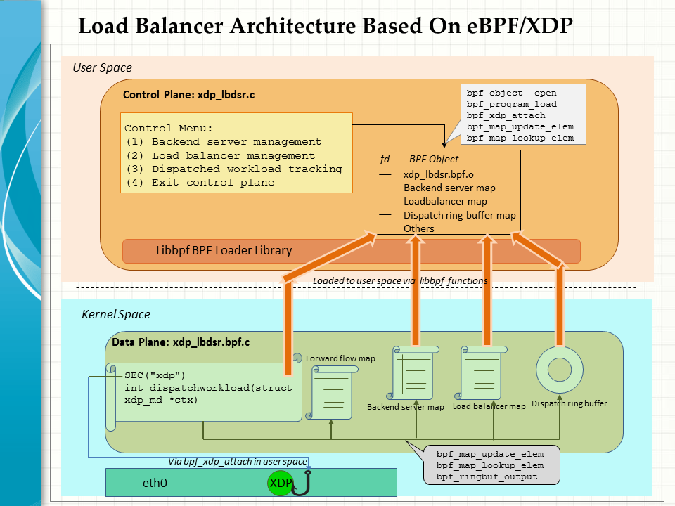
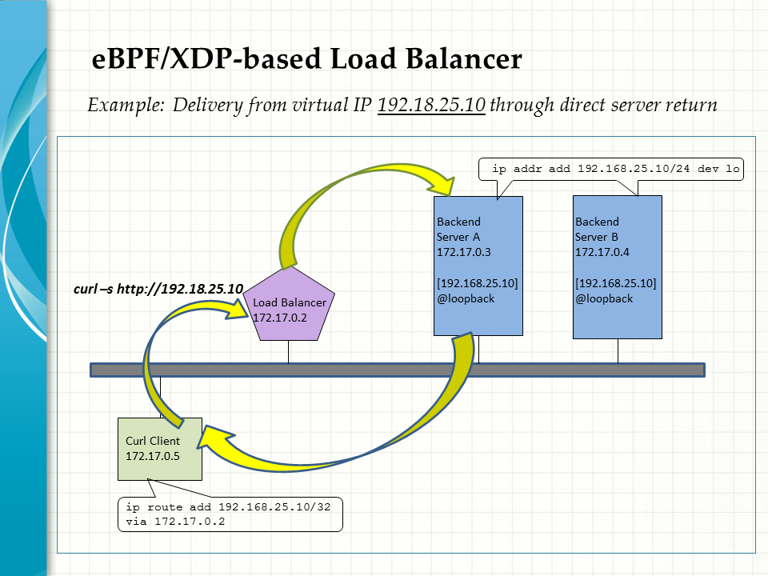

## eBPF/XDP-based Load Balancer Enhancement

A control plane is added to an load balancer that was created earlier to dispatch workloads through direct server return in an eBPF/XDP framework [(see here)](https://github.com/snpsuen/XDP_DSR_Load_Balancer). Instead of hardcording the configuation, user-defined bpf maps are applied together with a ring buffer to manage the backend servers, load balancer, track the dispatch activities and others. 

The load balancer is implemented by a bpf program running in the kernel space to redirect the network traffic on the data plane under the control of a user-space program.
* xdp_lbdsr.bpf.c (Data plane in the kernel space)
* xdp_lbdsr.c (Control plane in the user space)



### Use Case Example

The load balancer is tyically used for the so-called one-armed deployment, whereby it is attached via a single NIC to the same IP subnet as the client and backend servers. When the client issues a request for a service exposed from a virtual IP, the incoming traffic is routed by the load balancer to one of the backend servers in a random manner. Subsequent replies from the chosen backend server are returned directly to the client.

It is worthwhile to note that only the MAC addresses of network packets are required to change in the process. There is no need to modify any parts of the L3 headers and beyond all along.



### Setup and Experimentation

A testbed of docker containers is set up for experimentation with the use case example. The steps are pretty much the same as those of the [earlier repo](https://github.com/snpsuen/XDP_DSR_Load_Balancer) You may choose a Linux VM or a [Killercoda Ubuntu Playground] (https://killercoda.com/playgrounds/scenario/ubuntu) to start with as a host of the following containers.
* Load balancer: lbdsr01
* Backend Server A: backend-A
* Backend Server B: backend-B
* Curl client: curlclient01

#### 1  Build the load balancer
The load balancer is to be built on a Ubuntu container that is equipped with a full ePBF/XDP development environment.
1. Pull a pre-built eBPF/XDP ready docker to run a container as the platform of the load balancer.
```
docker run -d --privileged --name lbdsr0a -h lbdsr0a snpsuen/ebpf-xdp:v03
docker exec -it lbdsr0a bash
```
2. Download this repo and build the load balancer on both the control and data planes.
```
git clone https://github.com/snpsuen/XDP-LoadBalancer-Revamp
cd XDP*
make
```
3. Open a terminal to the host of the container and prepare for the on-going bpf_printk messages to be traced in real time.
```
sudo cat /sys/kernel/debug/tracing/trace_pipe
```

#### 2  Set up backend servers
1. Run a pair of backend servers on the nginx hello docker.
```
docker run -d --privileged --name backend-A -h backend-A nginxdemos/hello:plain-text
docker run -d --privileged --name backend-B -h backend-B nginxdemos/hello:plain-text
```
2. Login to each backend containers and assign a given virtual IP (VIP) as an alias address to the loopback interface.
```
docker exec -it backend-A sh
ip addr add 192.168.25.10/24 dev lo
```
Similar steps are taken on the backend-B container.

In this case, the VIP is set arbitraily to 192.168.10.25, which is totally separate from the physical address space of the testbed, 172.17.0.0/24. It will be used by clients to access the requested service through the load balancer.

#### 3  Set up a client container
1. Run a client container based on the latest curl docker.
```
docker run -d --privileged --name curlclient -h curlclient curlimages/curl:latest sleep infinity
```
2. Add a host route to the the VIP 192.168.10.25/32 via the load balancer at 172.17.0.2.
```
docker exec -it -u root curlclient sh
ip route add 192.168.25.10/32 via 172.17.0.2
```
More realistically, say in a production environment, it is necessary to arrange for the VIP host route to be originated as a stub link for advertisement by routing protocols like OSPF and BGP throughout an autonmous system and beyond.

#### 4  Test it out

1. Enter the load balancer container and run the control plane ./xdp_lbdsr with the default NIC eth0 and ring buffer pollong interval 1000 ms.
```
docker exec -it lbdsr0a bash
cd XDP_LBDSR*
./xdp_lbdsr
```


2. Issue a curl command from the curl client to the service VIP in a loop.
```
while true
do
curl -s http://192.168.25.10
sleep 3
echo ""
done
```
Expect to receive replies randomly from backend-A or backend-B.
```
/home/curl_user # while true
> do
> curl -s http://192.168.25.10
> sleep 3
> echo ""
> done
Server address: 192.168.25.10:80
Server name: backend-a
Date: 15/Jun/2023:09:03:44 +0000
URI: /
Request ID: 5821794b6313f1d4770201d5e79abad6

Server address: 192.168.25.10:80
Server name: backend-a
Date: 15/Jun/2023:09:03:47 +0000
URI: /
Request ID: d6ab760758ef93462a422bac5ce2a0cb

Server address: 192.168.25.10:80
Server name: backend-a
Date: 15/Jun/2023:09:03:50 +0000
URI: /
Request ID: aa3c365b30261d13726738c231b6d9f2

Server address: 192.168.25.10:80
Server name: backend-b
Date: 15/Jun/2023:09:03:53 +0000
URI: /
Request ID: 774487b5e3e01967e0bfb5fe86752d16

Server address: 192.168.25.10:80
Server name: backend-a
Date: 15/Jun/2023:09:03:56 +0000
URI: /
Request ID: 616153625c060cde7be942b234ed22a7

Server address: 192.168.25.10:80
Server name: backend-b
Date: 15/Jun/2023:09:03:59 +0000
URI: /
Request ID: d37c0af522469a2e4de74798d0166079
```


